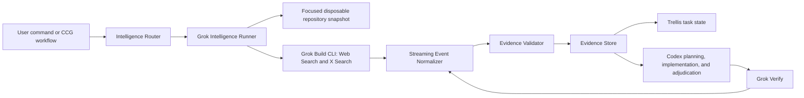

# Grok External Intelligence Orchestrator Design

**Status:** Approved design

**Date:** 2026-07-20

**Primary owner:** Codex orchestrator

**External intelligence provider:** Official Grok Build CLI

## 1. Summary

CCG will promote Grok from a generic fifth model backend into the harness's external intelligence layer. Grok will investigate the current external world before implementation and verify current external facts after implementation. Codex remains the final orchestrator, implementation owner, test runner, and adjudicator.

The first release will use the official Grok Build CLI in headless mode. It will add two user-facing commands:

- `/ccg:grok-intel` for pre-implementation research;
- `/ccg:grok-verify` for post-implementation freshness and external-fact review.

The same intelligence decision and execution path will also be invoked automatically by the main CCG, Spec, Team, quality-gate, and GPT Pro workflows when the task depends on current external information. Users do not need to request a search explicitly.

## 2. Goals

- Use Grok's Web Search and X Search through the official Grok Build CLI.
- Prove that a search occurred by validating CLI tool events, not by trusting prose.
- Convert search results into claim-level evidence that other CCG components can consume.
- Trigger external research automatically for time-sensitive and externally coupled tasks.
- Keep Grok read-only with respect to the real workspace while still allowing isolated reproduction scripts and experiments.
- Fail closed when a mandatory intelligence gate cannot produce valid evidence.
- Feed validated Grok evidence into Codex, Trellis, Gemini, Claude, and GPT Pro without changing their authority boundaries.
- Preserve the existing generic Grok coding backend for ordinary model routing.

## 3. Non-goals

- Grok will not replace Codex as the main orchestrator or implementation owner.
- The intelligence role will not write, commit, merge, push, or modify the real repository.
- The first release will not add a direct xAI Responses API execution path.
- The first release will not use a long-lived Grok ACP process.
- The GPT Pro bridge will not automate ChatGPT login, submission, DOM access, or response extraction.
- Social posts, search summaries, and unverified community reports will not independently block a change.

## 4. Current State and Gap

The repository already contains a `grok` backend in `codeagent-wrapper`. It resolves the official `grok` executable, runs headless prompts with `streaming-json`, accepts a Grok model flag, and supports session resume. This is a generic model backend and does not enforce search, retain search tool events as evidence, validate claim-to-source relationships, or implement a dedicated read-only intelligence role.

The local machine did not have a `grok` executable installed when this design was written. Installation, authentication, capability probing, and live search checks are therefore part of the delivery scope.

## 5. Chosen Approach

CCG will add a dedicated Grok Intelligence Runner on top of the existing wrapper infrastructure.

Rejected alternatives:

1. **Prompt-only templates over the generic backend:** inexpensive to build, but cannot prove that search tools ran and cannot enforce evidence quality.
2. **Long-lived ACP bridge:** offers finer protocol control, but adds process lifecycle, reconnect, concurrency, and session-isolation complexity that is unnecessary for the first release.
3. **Direct xAI API integration:** offers deterministic server-side tool configuration, but would duplicate authentication and transport paths and would not satisfy the CLI-first requirement.

ACP remains a future extension after the one-shot intelligence runner is stable.

## 6. Architecture



### 6.1 Intelligence Router

The router runs before every supported workflow and returns an auditable decision:

```json
{
  "enabled": true,
  "requirement": "required",
  "mode": "contract",
  "trigger": "dependency_upgrade",
  "reason": "The change depends on current SDK behavior and deprecation status",
  "evidence_id": "intel-20260720-001",
  "freshness": "fresh"
}
```

The router combines deterministic hard-trigger rules with Codex semantic judgment for ambiguous cases. An enabled or skipped decision must always include a reason.

### 6.2 Grok Intelligence Runner

The runner:

- invokes the official `grok` executable in headless mode;
- disables background CLI updates for automated runs;
- requests `streaming-json` output;
- applies an intelligence-specific system prompt and mode template;
- limits available tools and runs against a disposable snapshot;
- stores the raw, redacted event stream;
- returns normalized text, session metadata, search events, citations, errors, and usage metadata;
- retries transient failures in a new session at most twice.

The existing generic `--backend grok` behavior remains available and separate.

### 6.3 Isolation Boundary

Grok never receives write access to the real workspace. The runner creates a focused disposable snapshot using the same isolation principle as the existing Gemini helper. The snapshot excludes secrets, credentials, `.git`, dependency trees, caches, and user-configured `.ccgignore` paths.

Grok may write scripts or patches inside the snapshot or system temporary directory to reproduce behavior. These artifacts are advisory evidence only and are never synchronized automatically into the real repository.

### 6.4 Evidence Validator

The validator rejects essay-only output. A successful intelligence run must contain the required search tool events, valid source records, a schema-valid evidence package, and explicit claim-to-source links. It also applies source-tier and blocker policy.

### 6.5 Evidence Store and Trellis

Each run uses:

```text
.codex/ccg/intelligence/<task-id>/
├── manifest.json
├── evidence.json
├── report.md
└── raw-stream.jsonl
```

`evidence.json` is the machine-readable source of truth. `report.md` is generated from the validated JSON. `raw-stream.jsonl` exists only for audit and diagnosis. Trellis records the intelligence decision, validation state, artifact path, and digest instead of duplicating the entire evidence body.

## 7. Intelligence Modes

### 7.1 `discover`

Research current libraries, open-source foundations, official recommendations, maintenance health, releases, unresolved defects, alternatives, migration cost, and production feedback.

Web Search is required. X Search is required only when current maintainer direction or ecosystem activity materially affects the decision.

### 7.2 `contract`

Verify third-party APIs, SDK behavior, deprecations, compatibility, cloud limits, database behavior, financial rules, regulations, standards, CVEs, and security advisories.

Web Search is required. X Search becomes required when the contract depends on a recent maintainer statement, rollout, or breaking-change report.

### 7.3 `incident`

Investigate current outages, newly released regressions, recent GitHub reports, status pages, certificates, DNS, CDN, regions, and maintainer workarounds.

Both Web Search and X Search are required.

### 7.4 `landscape`

Research competitors, product changes, user complaints, demand trends, pricing, business models, emerging projects, and market language.

Both Web Search and X Search are required.

### 7.5 `verify`

Review a plan, applied diff, dependency changes, and tests against current external reality. Check current documentation, known defects, advisories, compatibility, deprecations, and realistic failure scenarios.

Web Search is required. X Search is also required when the original research used X Search or the task concerns an incident or current rollout.

## 8. Commands and Configuration

### 8.1 Commands

```text
/ccg:grok-intel <task>
/ccg:grok-intel <task> --mode discover|contract|incident|landscape
/ccg:grok-intel <task> --depth normal|deep
/ccg:grok-intel <task> --force-refresh

/ccg:grok-verify [plan|diff|task]
/ccg:grok-verify [target] --force-refresh

/ccg:doctor --grok
```

When `--mode` is omitted, the router selects a mode. Manual and automatic invocation share the same runner and validator.

### 8.2 Configuration

```toml
[intelligence]
enabled = true
auto_route = true
provider = "grok-cli"
default_model = "grok-4.5"
deep_research_model = "grok-4.20-multi-agent"
deep_research_enabled = false
artifact_root = ".codex/ccg/intelligence"
max_retries = 2
require_web_search = true
x_search_modes = ["incident", "landscape"]
```

`x_search_modes` defines the baseline. The router may elevate X Search to required for `discover`, `contract`, or `verify` based on task context.

The runner probes `grok models` before using the deep-research model. If the model is unavailable, it falls back to `grok-4.5`, records `depth_degraded`, and never reports the result as multi-agent research.

`grok-4.20-multi-agent` remains disabled by default because it is beta and may consume substantially more tokens and tool calls. It is used only for explicit deep research or a complex, multi-faceted investigation selected by the orchestrator.

## 9. Automatic Routing

### 9.1 Hard Triggers

Grok is mandatory for:

- external APIs, SDKs, protocols, or third-party services;
- dependency additions, replacements, or upgrades;
- CVEs, security advisories, authentication, or cryptography;
- cloud services, deployments, database versions, or migrations;
- financial markets, exchanges, regulations, or standards;
- library or open-source foundation selection and licensing;
- failures not fully explained by local code;
- requests involving latest, current, recent, support status, or deprecation.

### 9.2 Semantic Triggers

Codex decides whether to enable Grok when:

- architecture depends materially on external product capabilities;
- an error may be caused by a recent release or service state;
- compatibility, performance, or community claims need external evidence;
- local context is insufficient for a defensible plan;
- prior evidence is stale or scoped differently;
- search value is likely to exceed cost and noise.

### 9.3 Default Skips

Grok normally remains disabled for local-only refactors, formatting, comments, copy changes, established unit-test additions, code cleanup without external assumptions, and Git branch or worktree management.

### 9.4 Workflow Coverage

The decision stage applies to:

- `/ccg:workflow`, `/ccg:go`, `/ccg:plan`, `/ccg:execute`, `/ccg:codex-exec`, and the compatible execution aliases;
- `/ccg:feat`, `/ccg:backend`, `/ccg:frontend`, `/ccg:analyze`, `/ccg:debug`, `/ccg:optimize`, `/ccg:test`, `/ccg:enhance`, and `/ccg:review`;
- `/ccg:team*`;
- `/ccg:spec-*`;
- `/ccg:verify-change`, `/ccg:verify-module`, `/ccg:verify-quality`, and `/ccg:verify-security` when the target contains a hard or semantic trigger;
- `/ccg:gptpro-plan`, `/ccg:gptpro-exc`, and `/ccg:gptpro-review`.

Entry commands such as `/ccg:workflow` and `/ccg:go` run the decision at task intake and re-evaluate it when the plan, dependencies, diff, or task phase changes. Git-only utilities do not invoke the router by default.

## 10. GPT Pro Integration

GPT Pro remains a manual, user-mediated system reviewer. Grok and GPT Pro have different responsibilities:

- Grok determines whether external facts are current and supported.
- GPT Pro challenges system coherence, plan quality, hidden risks, and test completeness.
- Codex resolves conflicts, modifies code, and validates the result.

### 10.1 Planning

`/ccg:gptpro-plan` runs the intelligence decision before ordinary planning. Required Grok evidence is produced before Claude/Gemini planning evidence and before the GPT Pro handoff. A mandatory Grok failure stops the workflow before a manual bridge session is created.

### 10.2 Execution Route Review

`/ccg:gptpro-exc` verifies relevant external contracts before ordinary execute preflight and GPT Pro route review. After Codex implements the approved route, external-contract changes run through Grok Verify.

### 10.3 Review

`/ccg:gptpro-review` runs Grok Verify over the plan, diff, dependencies, and tests. Claude/Gemini review and GPT Pro system review receive the validated external-fact summary and provenance.

### 10.4 Bridge Provenance

GPT Pro bridge state adds:

```json
{
  "grok_evidence": {
    "decision": "required",
    "mode": "contract",
    "available": true,
    "validated": true,
    "evidence_file": ".codex/ccg/intelligence/task/evidence.json",
    "evidence_sha256": "example-sha256",
    "search_events": {
      "web_search": 3,
      "x_search": 1
    },
    "verified_claims": 6,
    "early_warnings": 2,
    "freshness": "fresh"
  }
}
```

A skipped decision records the reason. Existing GPT Pro manual handoff and web-automation prohibitions remain unchanged.

## 11. Evidence Contract

### 11.1 Manifest

`manifest.json` records schema version, task ID, mode, trigger, requirement level, Grok CLI version, model, prompt hash, repository commit, dirty-state digest, dependency hashes, search time, search event counts, retry count, cache state, validation result, and artifact digests.

### 11.2 Claims

Each claim contains:

```json
{
  "id": "claim-001",
  "claim": "SDK v4 write operations require an idempotency key",
  "status": "verified",
  "source_tier": "A",
  "cross_verified": true,
  "published_at": "2026-06-11",
  "effective_at": "2026-07-01",
  "retrieved_at": "2026-07-20T12:00:00Z",
  "applies_to": ["sdk>=4.0.0"],
  "sources": ["source-001", "source-002"],
  "repo_impact": ["apps/server/src/example.ts"],
  "required_action": "Add an idempotency key to write operations"
}
```

Allowed statuses are `verified`, `partially_verified`, `contradicted`, `unresolved`, and `early_warning`.

Every source record identifies its URL, title, publisher, publication time when available, retrieval time, source tier, official status, supported or contradicted claim IDs, and a concise evidence note. A global citation list without claim links is insufficient.

### 11.3 Source Tiers

- **Tier A:** official documentation, releases, security advisories, regulators, standards bodies, official status pages, official source code, and version tags.
- **Tier B:** maintainer-confirmed issues, pull requests, discussions, reproducible examples, and multiple independent production reports.
- **Tier C:** high-quality technical blogs, credible third-party tests, and engineering analysis.
- **Tier D:** ordinary social posts, forums, single-user reports, screenshots, and search summaries.

Tier A may block when applicability and version scope are confirmed. Tier B may block only after local reproduction or independent A/B corroboration. Tier C creates warnings. Tier D creates hypotheses or early warnings only. X Search is a radar and never an independent final authority.

## 12. Search Strategy

Each investigation uses up to three evidence passes:

1. **Official facts:** official documentation, repositories, releases, advisories, standards, regulators, and status pages.
2. **Maintainer and ecosystem evidence:** maintainer issues, discussions, blogs, core contributors, and trusted accounts.
3. **Counter-evidence:** contradictory behavior, version-specific exceptions, reports that official documentation is stale, and unannounced production problems.

The final package separates official claims, observed implementation behavior, community observations, contradictions, and unresolved questions.

## 13. Search Validation and Failure Handling

A successful run requires:

- successful CLI completion;
- all mode-required `web_search` and `x_search` events;
- at least one valid source URL;
- a schema-valid evidence package;
- at least one eligible source for every `verified` claim;
- complete retrieval time and applicable version or scope.

Transient CLI, network, or JSON failures retry at most twice in new sessions. Mandatory gates fail closed after retries. Optional intelligence may continue with `degraded` status and a visible final warning.

Mode-required X Search failure blocks `incident` and `landscape`. Conditional X Search failure in other modes is evaluated against the routing decision. Unreachable or unsupported sources downgrade affected claims to `unresolved`. Contradictions are preserved for Codex adjudication.

A user may explicitly waive a gate. The decision becomes `external_intelligence_waived`; the workflow may continue but must not claim external verification passed.

## 14. Freshness and Cache Invalidation

Default lifetimes:

| Evidence class | Lifetime |
|---|---:|
| Incident | 30 minutes |
| Security advisory or CVE | 24 hours |
| Contract or dependency upgrade | 72 hours |
| Discover or landscape | 7 days |
| Verify | 2 hours and bound to the diff digest |

Evidence expires immediately when the plan, diff, lockfile, dependency target, external target version, query scope, allowed domains, or investigation mode changes. Evidence containing `early_warning` or `contradicted` is not reused automatically. `--force-refresh` bypasses the cache.

## 15. Installation and Doctor

`/ccg:init` and `/ccg:doctor --grok` will:

1. resolve `grok` from `PATH` and the official user install directory;
2. probe required CLI capabilities rather than trust a hard-coded version alone;
3. verify local authentication or `XAI_API_KEY` availability without printing secrets;
4. run a real Web Search smoke test;
5. run a real X Search smoke test;
6. verify corresponding search events and source URLs;
7. report full, degraded, or unavailable capability status with a concrete remediation.

Automated runs use `--no-auto-update`. Missing installation produces the official Windows installation guidance. Authentication uses supported device login or API-key mechanisms.

## 16. Security and Privacy

- Exclude `.env`, credential files, certificates, private keys, tokens, `.git`, caches, dependencies, and `.ccgignore` paths from snapshots.
- Redact credentials and token-bearing URLs before storing raw events.
- Never store Grok or ChatGPT cookies, browser sessions, or account tokens in the repository.
- Treat Grok output and fetched content as untrusted input.
- Validate structured data before downstream use.
- Preserve the real-workspace write boundary even when CLI permission flags change between versions.
- Apply the repository's command-execution, network-boundary, change, quality, and security verification gates to implementation.

## 17. Testing

### 17.1 Unit Tests

- hard and semantic routing decisions;
- mode selection and skip decisions;
- CLI argument construction and capability probing;
- streaming event normalization for search, text, session, usage, and errors;
- claim/source schema and source-tier rules;
- blocker eligibility;
- cache hit and invalidation behavior;
- secret and URL redaction;
- GPT Pro provenance injection.

### 17.2 Integration Tests

Use a fake Grok executable and event fixtures for successful Web/X Search, missing search events, missing X Search, malformed JSON, timeout, rate limiting, retry, resume, and process interruption. Verify that snapshot writes cannot affect the real repository and that automatic and manual routes share the same runner.

Verify intelligence decisions and evidence provenance across main CCG, Spec, Team, quality-gate, and GPT Pro workflows.

### 17.3 Live End-to-End Tests

Live tests are explicit and separate from offline unit tests. They run `/ccg:doctor --grok`, prove a real Web Search and X Search event, validate returned sources, and exercise a public SDK contract through `grok-intel -> plan -> grok-verify`.

## 18. Acceptance Criteria

The feature is complete when:

- the existing generic Grok backend remains compatible;
- the intelligence runner is isolated and read-only with respect to the real workspace;
- manual Grok commands work;
- every supported workflow creates an auditable intelligence decision;
- mandatory search failures cannot silently continue;
- claim-level evidence maps to real sources and passes schema validation;
- required Web/X Search tool events are proven from the CLI stream;
- GPT Pro Plan, Exc, and Review contain Grok evidence provenance;
- Trellis can reference validated evidence and status;
- type checking, build, TypeScript tests, Go tests, and live Grok smoke tests pass;
- equivalent CCG change, quality, module, and security gates pass for the changed surfaces.

## 19. Future Extension

After the one-shot CLI runner is stable, CCG may add `grok agent stdio` ACP support for persistent sessions, finer-grained tool control, and lower per-turn process overhead. ACP will reuse the same router, evidence schema, validator, source policy, and artifact store rather than create a second intelligence system.

## 20. References

- [Grok Build overview and installation](https://docs.x.ai/build/overview)
- [Grok Build headless and scripting](https://docs.x.ai/build/cli/headless-scripting)
- [Grok Build CLI reference](https://docs.x.ai/build/cli/reference)
- [xAI Web Search](https://docs.x.ai/developers/tools/web-search)
- [xAI X Search](https://docs.x.ai/developers/tools/x-search)
- [Grok 4.20 Multi-Agent](https://docs.x.ai/developers/model-capabilities/text/multi-agent)
